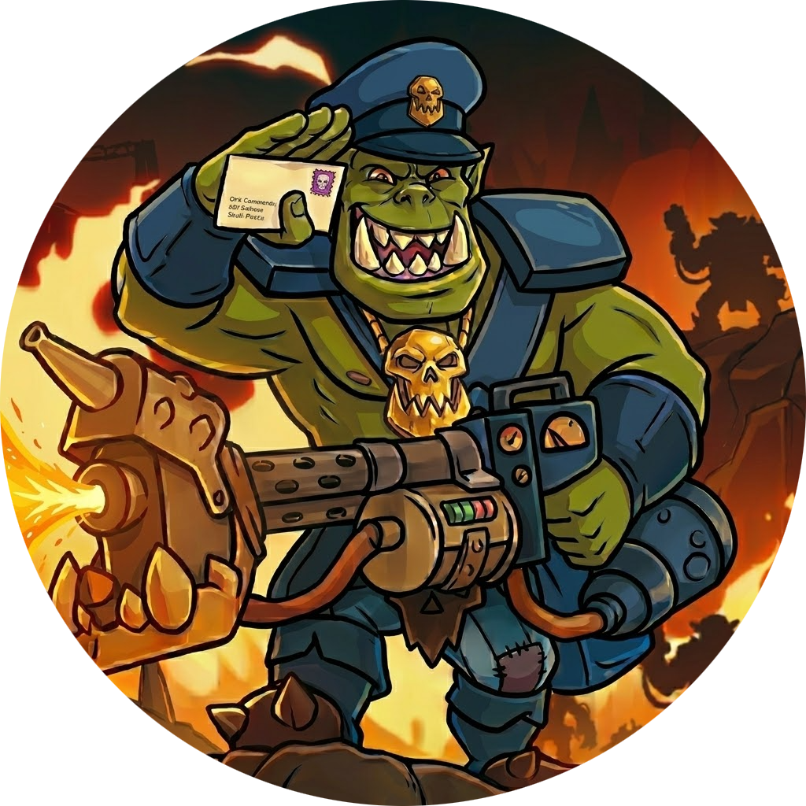

<p align="center">
    
</p>

<h1 align="center">Da Postork</h1>


[](./LICENSE)


Stay updated on your favorite news directly in Discord!
**Da Postork** brings you the latest articles from multiple sources, straight to your server or DMs.

## Getting Started

### Add the bot to your Discord server

Start by adding **Da Postork** to your server

👉 <a href="https://discord.com/oauth2/authorize?client_id=1161725703931297886" target="_blank">INSTALLATION LINK</a>

> Make sure you grant the [required permissions](#bot-required-permissions) to the bot

#### Quick usage

Once the bot is added, you can start using it immediately:

```bash
/subscribe
```

Select a source, and you're done.
New articles will automatically be posted in your channel or DMs.

[Other useful commands here!](#commands)

#### Bot required permissions

##### To send embeds

- `View Channel`
- `Send Messages`
- `Embed Links`

##### To add reactions (optional)

- `Read Message History`
- `Add Reactions`

## Features

- Subscribe any Discord channel or DM to one or more [news sources](#sources)
- Get notified automatically whenever a new article is published
- Manage your subscriptions with simple [slash commands](#commands)

### Sources

| Source                  | Description                                               |
| ----------------------- | --------------------------------------------------------- |
| **Warhammer Community** | The essential Warhammer news and features site            |
| **Marvel**              | Official Marvel news and announcements                    |
| **Gundam Official**     | Gundam news, covering anime, movies, products, and events |
| **CodexYGO**            | The leading Yu-Gi-Oh! news site in France                 |

### Commands

| Command          | Description                              | User required permission |
| ---------------- | ---------------------------------------- | ------------------------ |
| `/subscribe`     | Subscribe this channel to a source       | Manage Channels          |
| `/unsubscribe`   | Unsubscribe this channel from a source   | Manage Channels          |
| `/subscriptions` | List this channel's active subscriptions | N/A                      |

## Self-hosting

Want to run your own instance of **Da Postork**? Here's how.

### Prerequisites

- [Docker](https://www.docker.com/) and Docker Compose
- A Discord bot token ([create one here](https://discord.com/developers/applications))

### Installation

1. Clone the repository:

```bash
git clone https://github.com/FiestaTheNewbieDev/da-postork.git
cd da-postork
```

2. Create the production environment file:

```bash
cp .env.example .env.production
```

3. Fill in the required values in `.env.production`:

```env
DISCORD_BOT_TOKEN=      # Your Discord bot token

POSTGRES_HOST=postgres
POSTGRES_PORT=5432
POSTGRES_USER=postgres
POSTGRES_PASSWORD=      # Choose a secure password
POSTGRES_DB=da_postork

REDIS_HOST=redis
REDIS_PORT=6379
```

4. Start the application:

```bash
docker compose up -d
```

Docker will automatically run database migrations before starting the bot.

## License

This project is licensed under the **GNU General Public License v3.0**. See [LICENSE](./LICENSE) for details.
